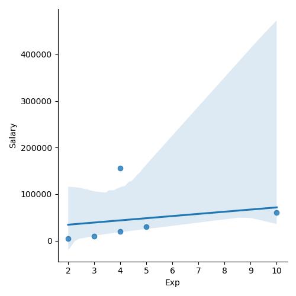
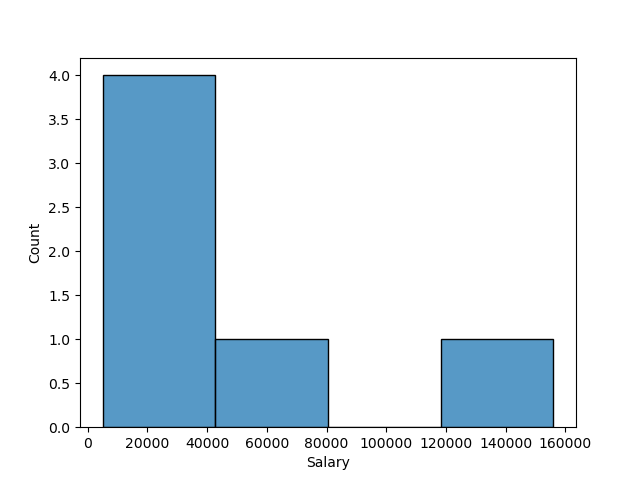
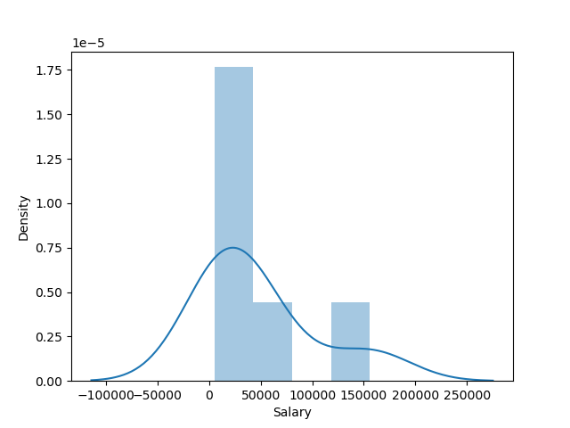
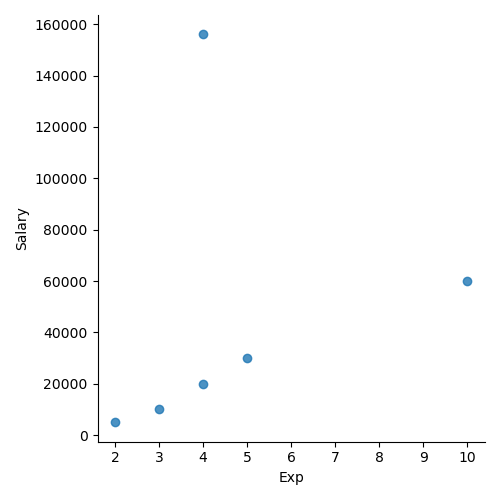

# Exploratory Data Analysis (EDA)

## 📌 Overview

This repository demonstrates various Exploratory Data Analysis (EDA) techniques using Python on real-world datasets.

The project focuses on understanding datasets before applying machine learning algorithms.

---

## Objectives

- Understand dataset structure
- Handle missing values
- Detect outliers
- Explore feature distributions
- Study relationships between variables

---

## Tools Used

- Python
- NumPy
- Pandas
- Matplotlib
- Seaborn

---

## Dataset

Dataset Name: raw_data.csv

Rows: 6

Columns: 6

---

## Techniques Performed

✔ Missing Value Analysis

✔ Duplicate Detection

✔ Summary Statistics

✔ Correlation Analysis

✔ Histograms

✔ Boxplots

✔ Pairplots

✔ Heatmaps

---
# Exploratory Data Analysis (EDA)

## Correlation plot



---

## Histogram



---

## Distribution plot



---

## Outlier Detection Plot



---


## Project Structure

```
EDA-Techniques/

dataset/

notebooks/

images/

README.md

requirements.txt
```

---

## Results

The analysis identified

- Missing values
- Feature distributions
- Correlation between variables
- Presence of outliers

---

## Author

Akash Salunkhe
